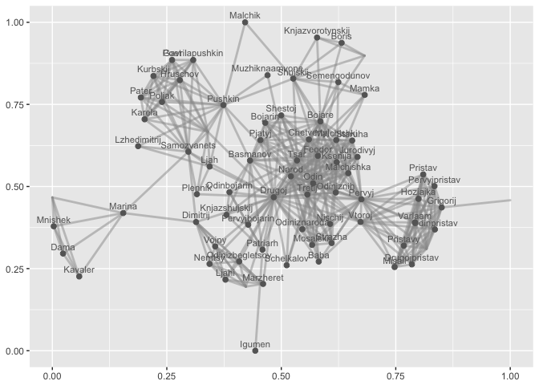

Drama Analysis
================
Ira Pavlova
May 2017

### This project is devoted to studying the evolution of Russian drama. The study is based on the Russian Drama Corpus which now contains 49 Russian plays encoded in TEI. The creation time of plays ranges from 1747 to 1925.

``` r
library(tidyverse)
library(plotly)
library(plotrix)
library(network)
library(sna)
library(GGally)
library(geomnet)
library(ggnetwork)
library(igraph)


setwd('/Users/IrinaPavlova/Desktop/Uni/Бакалавриат/2015-2016/Programming/github desktop/RusDraCor/Calculating_stuff_in_plays')
data = read.csv('calculations.csv', stringsAsFactors=FALSE)
data = data.frame(data)
data[data=="empty weights"] <- 0
data[, 5:6] <- sapply(data[, 5:6], as.numeric)
data
```

### This graph shows how the number of characters in plays was changing from 1750 to 1950. The observations are the mean number of characters in plays of a particular year.

``` r
char_data <- aggregate(data[, 4], list(Year_of_creation=data$Year_of_creation), mean)
BG <- subset(char_data, Year_of_creation == "1825")

char_data %>% ggplot(aes(Year_of_creation, x)) +
  geom_point() +
  geom_line() + scale_x_continuous(breaks=seq(1700, 1950, 50)) +
  geom_text(data=BG, label="Boris Godunov", vjust=1) +
  labs(title='Number of characters in Russian drama',
       y='Number of characters', x='Year of creation')
```


### This graph shows how the number of scenes/acts in plays was changing from 1750 to 1950. The observations are the mean number of scenes/acts in plays of a particular year.

``` r
scenes_data <- aggregate(data[, 3], list(Year_of_creation=data$Year_of_creation), mean)

scenes_data %>% ggplot(aes(Year_of_creation, x)) +
  geom_point() +
  geom_line() + scale_x_continuous(breaks=seq(1700, 1950, 50)) +
  labs(title='Number of scenes/acts in Russian drama',
       y='Number of scenes/acts', x='Year of creation')
```


### This graph shows how the maximum degree of a character in plays was changing from 1750 to 1950. The observations are the mean number of max degree in plays of a particular year.

``` r
degree_data <- aggregate(data[, 6], list(Year_of_creation=data$Year_of_creation), mean)
BG <- subset(degree_data, Year_of_creation == "1825")

degree_data %>% ggplot(aes(Year_of_creation, x)) +
  geom_point() +
  geom_line() + scale_x_continuous(breaks=seq(1700, 1950, 50)) +
  geom_text(data=BG, label="Boris Godunov") +
  labs(title='Max character degree in Russian drama',
       y='Max degree', x='Year of creation')
```


### Making network visualization

``` r
boris_godunov <- read.csv('ready_CSV/Pushkin_-_Boris_Godunov.csv', sep = ";")
boris_godunov <- boris_godunov[, c(1, 3, 4)]
head(boris_godunov)
```

    ##           Source        Target Weight
    ## 1         Bojare    Malchishka      1
    ## 2        Plennik   Samozvanets      1
    ## 3     Malchishki          Odin      1
    ## 4 Muzhiknaamvone       Pushkin      1
    ## 5       Grigorij Pervyjpristav      1
    ## 6        Nischij  Odiniznaroda      1

``` r
net <- graph_from_data_frame(d=boris_godunov, directed=F)
net
```

    ## IGRAPH UN-- 75 385 -- 
    ## + attr: name (v/c), Weight (e/n)
    ## + edges (vertex names):
    ##  [1] Bojare        --Malchishka       Plennik       --Samozvanets     
    ##  [3] Malchishki    --Odin             Muzhiknaamvone--Pushkin         
    ##  [5] Grigorij      --Pervyjpristav    Nischij       --Odiniznaroda    
    ##  [7] Schelkalov    --Tretij           Ljah          --Vse             
    ##  [9] Kurbskij      --Pushkin          Feodor        --Tretij          
    ## [11] Boris         --Knjazvorotynskij Malchishki    --Drugoj          
    ## [13] Poet          --Vse              Samozvanets   --Vse             
    ## [15] Staruha       --Tretij           Jurodivyj     --Tretij          
    ## + ... omitted several edges

``` r
E(net)$weight <- boris_godunov$Weight
clust <- cluster_optimal(net)
modularity(clust)
```

    ## [1] 0.5169897

``` r
membership(clust)
```

    ##           Bojare          Plennik       Malchishki   Muzhiknaamvone 
    ##                1                2                1                2 
    ##         Grigorij          Nischij       Schelkalov             Ljah 
    ##                3                4                1                2 
    ##         Kurbskij           Feodor            Boris           Drugoj 
    ##                2                4                4                1 
    ##             Poet      Samozvanets          Staruha        Jurodivyj 
    ##                2                2                1                1 
    ##       Chetvertyj     Semengodunov   Gavrilapushkin         Basmanov 
    ##                1                4                2                1 
    ##        Marzheret        Mosalskij         Shujskij            Mamka 
    ##                5                4                4                4 
    ##         Hozjajka  Odinizbegletsov       Malchishka        Odiniznih 
    ##                3                5                1                1 
    ##          Pristav             Odin          Ksenija     Lzhedimitrij 
    ##                3                1                4                2 
    ##           Karela         Hruschov            Voiny           Igumen 
    ##                2                2                5                1 
    ##          Bojarin           Pervyj           Marina           Misail 
    ##                1                3                6                3 
    ##            Narod      Odinpristav         Dimitrij    Drugojpristav 
    ##                1                3                5                3 
    ##             Baba           Poljak          Varlaam    Knjazshujskij 
    ##                1                2                3                1 
    ##             Dama          Strazha    Pervyjbojarin            Ljahi 
    ##                6                4                1                5 
    ##           Nemtsy          Malchik          Kavaler         Pristavy 
    ##                5                4                6                3 
    ##         Patriarh           Pjatyj    Pervyjpristav          Pushkin 
    ##                1                1                3                2 
    ##           Tretij          Mnishek             Tsar            Pater 
    ##                1                6                1                2 
    ##      Odinbojarin     Odiniznaroda           Vtoroj Knjazvorotynskij 
    ##                1                4                3                4 
    ##          Shestoj              Vse           Vrozen    Vtorojpristav 
    ##                1                2                5                3 
    ##      Vorotynskij    Vishnevetskij            Pimen 
    ##                4                6                3

``` r
E(net)$weight > 1
```

    ##   [1] FALSE FALSE FALSE FALSE FALSE FALSE FALSE FALSE FALSE  TRUE FALSE
    ##  [12] FALSE FALSE  TRUE FALSE FALSE FALSE FALSE FALSE FALSE FALSE FALSE
    ##  [23] FALSE FALSE FALSE FALSE FALSE FALSE FALSE FALSE  TRUE FALSE FALSE
    ##  [34] FALSE FALSE FALSE FALSE FALSE FALSE FALSE FALSE FALSE FALSE FALSE
    ##  [45] FALSE FALSE FALSE  TRUE FALSE FALSE FALSE FALSE FALSE FALSE FALSE
    ##  [56] FALSE FALSE FALSE FALSE FALSE FALSE FALSE FALSE FALSE FALSE FALSE
    ##  [67] FALSE FALSE FALSE FALSE  TRUE FALSE FALSE FALSE FALSE FALSE FALSE
    ##  [78] FALSE FALSE FALSE FALSE FALSE FALSE FALSE FALSE FALSE FALSE  TRUE
    ##  [89] FALSE FALSE FALSE FALSE FALSE FALSE  TRUE  TRUE FALSE  TRUE FALSE
    ## [100] FALSE FALSE FALSE FALSE  TRUE FALSE FALSE FALSE FALSE FALSE FALSE
    ## [111] FALSE FALSE FALSE FALSE FALSE FALSE FALSE  TRUE FALSE FALSE FALSE
    ## [122] FALSE FALSE FALSE FALSE FALSE FALSE FALSE FALSE FALSE FALSE FALSE
    ## [133] FALSE FALSE FALSE  TRUE  TRUE FALSE FALSE FALSE FALSE FALSE FALSE
    ## [144] FALSE FALSE FALSE FALSE FALSE FALSE  TRUE FALSE FALSE FALSE FALSE
    ## [155]  TRUE FALSE FALSE FALSE FALSE  TRUE FALSE FALSE FALSE FALSE FALSE
    ## [166] FALSE FALSE FALSE FALSE FALSE FALSE FALSE FALSE FALSE FALSE FALSE
    ## [177] FALSE FALSE FALSE FALSE FALSE  TRUE FALSE FALSE FALSE FALSE FALSE
    ## [188] FALSE  TRUE FALSE FALSE FALSE FALSE FALSE FALSE FALSE FALSE FALSE
    ## [199]  TRUE FALSE FALSE FALSE FALSE FALSE FALSE  TRUE FALSE FALSE FALSE
    ## [210] FALSE  TRUE FALSE FALSE FALSE FALSE FALSE  TRUE FALSE FALSE FALSE
    ## [221] FALSE FALSE  TRUE FALSE FALSE FALSE FALSE FALSE FALSE FALSE FALSE
    ## [232] FALSE FALSE FALSE FALSE FALSE FALSE FALSE FALSE FALSE FALSE FALSE
    ## [243] FALSE FALSE FALSE FALSE FALSE FALSE FALSE FALSE FALSE FALSE FALSE
    ## [254] FALSE FALSE  TRUE  TRUE FALSE FALSE FALSE FALSE FALSE FALSE FALSE
    ## [265] FALSE FALSE FALSE FALSE FALSE FALSE  TRUE FALSE FALSE FALSE FALSE
    ## [276] FALSE FALSE FALSE FALSE FALSE FALSE FALSE FALSE  TRUE FALSE FALSE
    ## [287] FALSE FALSE FALSE FALSE FALSE  TRUE FALSE FALSE FALSE FALSE FALSE
    ## [298] FALSE FALSE FALSE  TRUE FALSE FALSE FALSE FALSE FALSE FALSE FALSE
    ## [309] FALSE  TRUE FALSE FALSE FALSE FALSE FALSE  TRUE FALSE FALSE FALSE
    ## [320] FALSE FALSE  TRUE FALSE FALSE FALSE FALSE FALSE FALSE FALSE FALSE
    ## [331] FALSE FALSE FALSE  TRUE FALSE FALSE FALSE FALSE FALSE FALSE FALSE
    ## [342] FALSE FALSE FALSE FALSE FALSE FALSE FALSE FALSE FALSE FALSE FALSE
    ## [353] FALSE FALSE FALSE FALSE FALSE FALSE FALSE FALSE FALSE FALSE FALSE
    ## [364] FALSE FALSE FALSE FALSE FALSE FALSE FALSE FALSE FALSE FALSE FALSE
    ## [375] FALSE FALSE FALSE  TRUE FALSE FALSE FALSE FALSE FALSE FALSE  TRUE

``` r
# prettyColors <- c("turquoise4", "azure4", "olivedrab","deeppink4")
# communityColors <- prettyColors[membership(clust)]

layout = layout.fruchterman.reingold(net)

layout=layout.kamada.kawai(net, kkconst=50)

# vertex.label= ifelse(V(net)$name %in% c('Drugoj'),V(net)$name, NA)

plot(net,
     vertex.size=3,
     edge.arrow.size=.6,
     vertex.label=V(net)$name,
     edge.width=E(net)$weight*0.5,
     layout=layout.graphopt,
     vertex.label.color = "black",
     vertex.label.cex = 0.5,
     vertex.color = membership(clust))
```


``` r
net <- network(boris_godunov, directed=FALSE)
ggplot(data = boris_godunov, aes(from_id=Source, to_id=Target)) + geom_net(layout.alg = "kamadakawai", 
           size = 2, labelon = TRUE, vjust = -0.6, ecolour = "grey60",
           directed =FALSE, fontsize = 3, ealpha = 0.5)
```



### Notes

1. Keep CamelCase when tranforming TEI to CSV
=============================================

2. Use clustering in igraph
===========================

3. Add degree tables (as vertices to net)
=========================================
