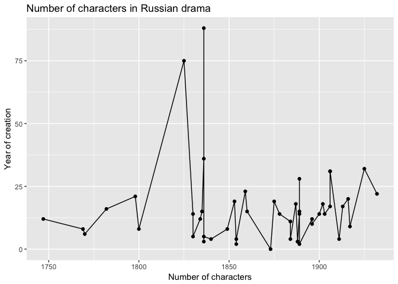

Dramas\_Analysis
================
Ira Pavlova
08.05.2017

------------------------------------------------------------------------

This is an R Markdown document. Markdown is a simple formatting syntax for authoring HTML, PDF, and MS Word documents. For more details on using R Markdown see <http://rmarkdown.rstudio.com>.

When you click the **Knit** button a document will be generated that includes both content as well as the output of any embedded R code chunks within the document. You can embed an R code chunk like this:

``` r
library(tidyverse)
library(plotly)
library(plotrix) 
setwd('/Users/IrinaPavlova/Desktop/Uni/Бакалавриат/2015-2016/Programming/github desktop/RusDraCor/Calculating_stuff_in_plays')
data = read.csv('calculations.csv')
data = data.frame(data)
data
```

``` r
plot <- ggplot(data, aes(Year_of_creation, Num_of_char))
plot <- plot + geom_point() + geom_line()
plot <- plot + scale_x_continuous(breaks=seq(1700, 1950, 50))
plot <- plot + labs(title='Number of characters in Russian drama', x='Number of characters', y='Year of creation')
plot
```

    ## Warning: Removed 1 rows containing missing values (geom_point).

    ## Warning: Removed 1 rows containing missing values (geom_path).


